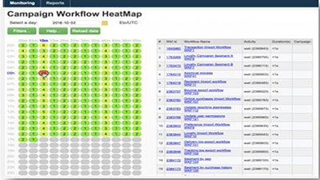
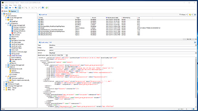
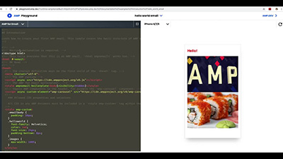

# Tutoriels Adobe Campaign Classic V7 - Vue d&#39;ensemble

Adobe Campaign offre une plateforme pour concevoir des expériences client cross-canal et propose un environnement pour l&#39;orchestration visuelle de campagnes, la gestion d&#39;interactions en temps réel et l&#39;exécution cross-canal. Ce guide de l&#39;utilisateur contient des vidéos et des tutoriels sur les nombreuses fonctionnalités d&#39;Adobe Campaign Classic V7.

>[!INFO]
> Avez-vous des questions ? Voulez-vous partager votre expérience ou échanger des idées avec vos pairs ? Ou avez-vous à formuler des commentaires concernant le contenu de formation pour l&#39;équipe d&#39;Adobe ? Rejoignez la conversation dans le [thread de la communauté d&#39;apprentissage Adobe Campaign](https://experienceleaguecommunities.adobe.com:443/t5/adobe-campaign-classic/join-the-discussion-on-adobe-campaign-learning/td-p/419096) !

## Nouveautés

* **[Exploration et dépannage détaillés du protocole SMPP](https://experienceleague.adobe.com/docs/campaign-learn/set-up-sms-for-adobe-campaign/smpp-deep-dive-and-troubleshooting.html)**

   *Découvrez comment les connexions SMPP sont établies et comment SMPP échange des données par le biais de PDU. Découvrez comment résoudre les problèmes de connexion.*

* **[Panneau de contrôle pour les modèles d&#39;hébergement hybrides](https://experienceleague.adobe.com/docs/control-panel-learn/control-panel/control-panel-for-hybrid-hosting-models.html?lang=fr)**

   *Découvrez comment activer le panneau de contrôle pour les modèles d&#39;hébergement hybrides Adobe Campaign, accéder au panneau de contrôle et déverrouiller les fonctionnalités clés.*

* **[Panneau de contrôle - surveiller les workflows](https://experienceleague.adobe.com/docs/control-panel-learn/control-panel/performance-monitoring/monitor-workflows.html?lang=fr){target=&quot;_blank&quot;}**

   *Découvrez comment surveiller l’utilisation de l’espace de stockage temporaire de vos workflows et où configurer les paramètres de workflows pour éviter des problèmes liés aux bases de données ou aux workflows sur votre instance.*

* **[Panneau de contrôle - surveiller les débits et la latence](https://experienceleague.adobe.com/docs/control-panel-learn/control-panel/performance-monitoring/monitor-throughputs-and-latency.html?lang=fr){target=&quot;_blank&quot;}**

   *Découvrez comment surveiller les débits de diffusion et les latences des messages transactionnels de votre instance Campaign.*

* **[Présentation des SMS](https://experienceleague.adobe.com/docs/campaign-learn/set-up-sms-for-adobe-campaign/introduction-to-sms.html)**

   *Découvrez le fonctionnement des SMS et comment Adobe Campaign envoie des SMS*

* **[Créez un compte SMS pour un fournisseur SMPP standard](https://experienceleague.adobe.com/docs/campaign-learn/set-up-sms-for-adobe-campaign/set-up-account-for-standard-smpp-provider.html)**

   *Découvrez comment adapter le connecteur SMS à votre fournisseur SMPP. Ajustez les paramètres SMS pour gérer les limites de connexion, configurer le débit maximal, la fenêtre d’envoi et le chiffrement avec TLS.*

## Sélections du personnel

<table>
<tr>
  <td>
    
    

      <a href="./monitoring-campaign-classic/workflow-heatmap.md">
    <strong>Cartes thermiques des workflows</strong>
    </a>
    

    

    <em>Obtenez un aperçu du nombre de workflows simultanés.</em>
    

  </td>
   <td>
    
    

      <a href="./monitoring-campaign-classic/audit-trail.md">
    <strong>Journal d'audit</strong>
    </a>
    
 
    

    <em>Capturez une liste complète d'actions et d'événements se produisant dans Adobe Campaign.</em>
    

  </td>
  <td>
    
    

      <a href="./sending-messages/email-channel/defining-interactive-email-content-with-amp.md">
    <strong>Définition du contenu d'e-mail interactif avec AMP</strong>
    </a>
    

    

    <em>Découvrez comment activer et utiliser AMP dans Adobe Campaign Classic </em>
    

  </td>
</tr>
</table>

## Ressources supplémentaires

* [Documentation](https://experienceleague.adobe.com/docs/campaign-classic/using/getting-started/starting-with-adobe-campaign/about-adobe-campaign-classic.html?lang=fr)
